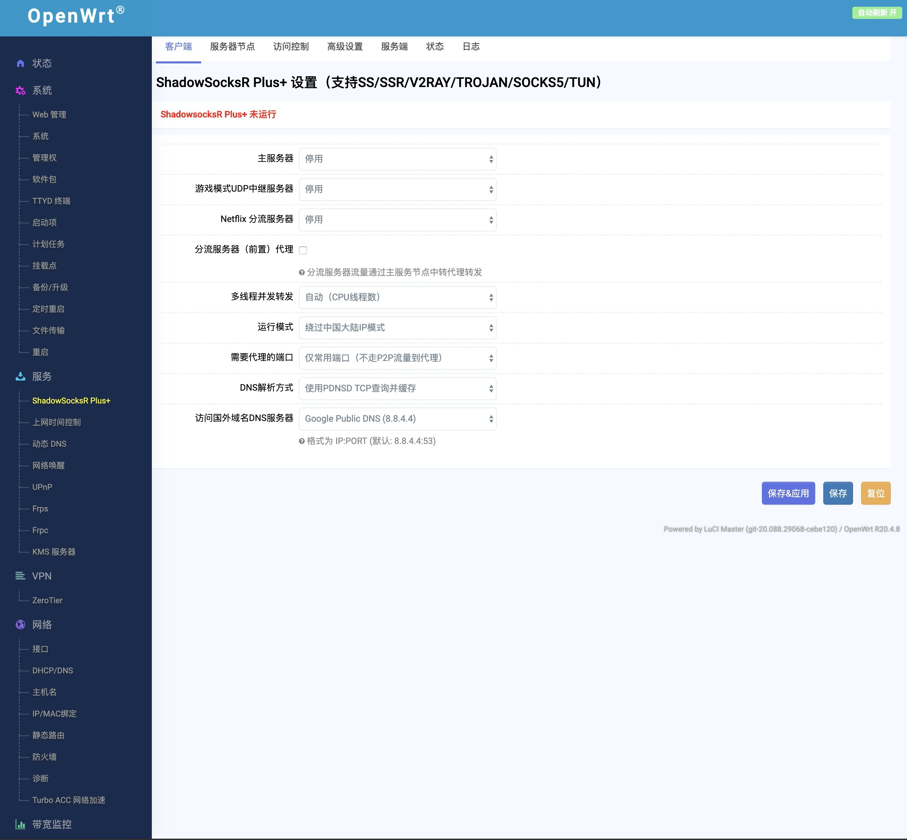

#### OpenWrt原生源码+Simons的patch编译，使用前请仔细阅读如下说明：
1. 原版主线OpenWrt，内核5.4，Luci 19.07+SNAPSHOT均当日最新，默认开启BBR。
2. Full版包含adguard home、ssr-plus、docker、ttyd、zerotier、transmission、smartdns、samba4、openclash、frpc/frps、trojan server、应用过滤、ddns、多线多拨（单线多拨无法叠加带宽）等功能
3. Slim版仅有ssrp、trojan-server、frpc/frps、ddns、应用过滤、zerotier及transmission，京东签到等常用功能。 
3. 管理地址: 192.168.1.1 默认空密码
4. 驱动原因，暂只支持rtl8192cu芯片(仅2.4G)及mt76x2u芯片USB无线网卡，rtl8821cu/8811cu的驱动未测试通过，MT7601芯片驱动不支持AP模式。
5. 已测试支持Hilink模式的4G USB上网卡，NCM模式测试中。
6. 仅打包原版bootstrap主题，请勿轻易安装其它主题（19.07多数不兼容）。
7. 支持第3代金属壳OLED显示R2S系统信息。
8. 仅打包原版bootstrap主题，请勿轻易安装其它主题（19.07多数不兼容）。
9. 建议关闭ipv6的dns解析，以免影响网络体验，Network-DHCP and DNS-Advanced Settings-Filter IPv6 Records。
10. 默认关闭ipv6，有需要的自行开启。
11. 注意R2S网口默认MAC address相同，LAN内同时存在多个R2S请自行修改MAC为唯一。
12. Openwrt原生更新升级功能，支持各种备份、恢复及系统重置。
13. 从友善版固件刷写本固件，建议使用dd写卡：
```
dd if=/tmp/upload/openwrt.img of=/dev/mmcblk0 conv=fsync
```
14. 为避免写卡没有覆盖完全，建议首次启动后先运行firstboot清除再重启一次
15. 上游代码及编译yml更新频繁。自用测试固件，风险自负，不提供任何DaaS.
16. 下载见[OpenWrt-R2S固件](https://github.com/quintus-lab/Openwrt-R2S/releases/tag/OpenWrt)

### 感谢

- [QiuSimons](https://github.com/QiuSimons/R2S-OpenWrt)
- [Lean](https://github.com/coolsnowwolf/lede)
- [Klever1988](https://github.com/klever1988/nanopi-openwrt)
- [fanck0605](https://github.com/fanck0605/nanopi-r2s)
- [P3TERX](https://github.com/P3TERX/Actions-OpenWrt)
- [Read the details in my blog (in Chinese) | 中文教程](https://p3terx.com/archives/build-openwrt-with-github-actions.html)

#### License
[MIT]


#### Openwrt原生系統截圖：


#### Friendlywrt只是用作给一块开发板点亮，各种功能需要杂交移植，随着原生Openwrt对R2S的成熟支持，个人认为Friendlywrt的历史使命已完结。<br> 

#### 保留下Friendlywrt的数个编译版本，不再作任何编译更新，下载见[FriendlyWrt-R2S固件](https://github.com/quintus-lab/Openwrt-R2S/releases/tag/FriendlyWrt)<br> 
按应用筛选分成3版本，均不包含任何广告拦截应用。
1. 极简的tiny版，仅包含ssr-plus、ddns(不支持任何USB无线网卡，支持U盘)
2. 瘦身的slim版，包括有ssr-plus、frpc/frps、ttyd、zerotier（支持部分USB无线网卡，只测试过811AC）
3. 定制opt版在精简版基础上增加docker、transmission、等较常用功能等。（支持部分USB无线网卡，只测试过811AC）
4. 默认管理地址:192.168.2.1  用户名:root  密码:password
#### Friendlywrt版R2S刷机方法：
7. 使用gary lau的在线更新脚本，可选择保存配置升级，或下载固件后通过web管理页的“文件传输”上传到更新，支持多种R2S编译版本互刷，通过web管理页面的TTYD或SSH到R2S后执行下载脚本并执行：<br> 
```
wget -q https://github.com/quintus-lab/Openwrt-R2S/raw/master/script/update.sh && sh ./update.sh
```
8. 4.18之后固件已预装[songchenwen](https://github.com/songchenwen/nanopi-r2s)大佬的R2S刷机，可在web页面直接升级，与通常的OpenWrt刷机方法无异 <br> 
[R2S刷机IPK链接](https://github.com/quintus-lab/Openwrt-R2S/raw/master/other/luci-app-r2sflasher_1.0-4_all.ipk) 

#### Friendlywrt截圖：
