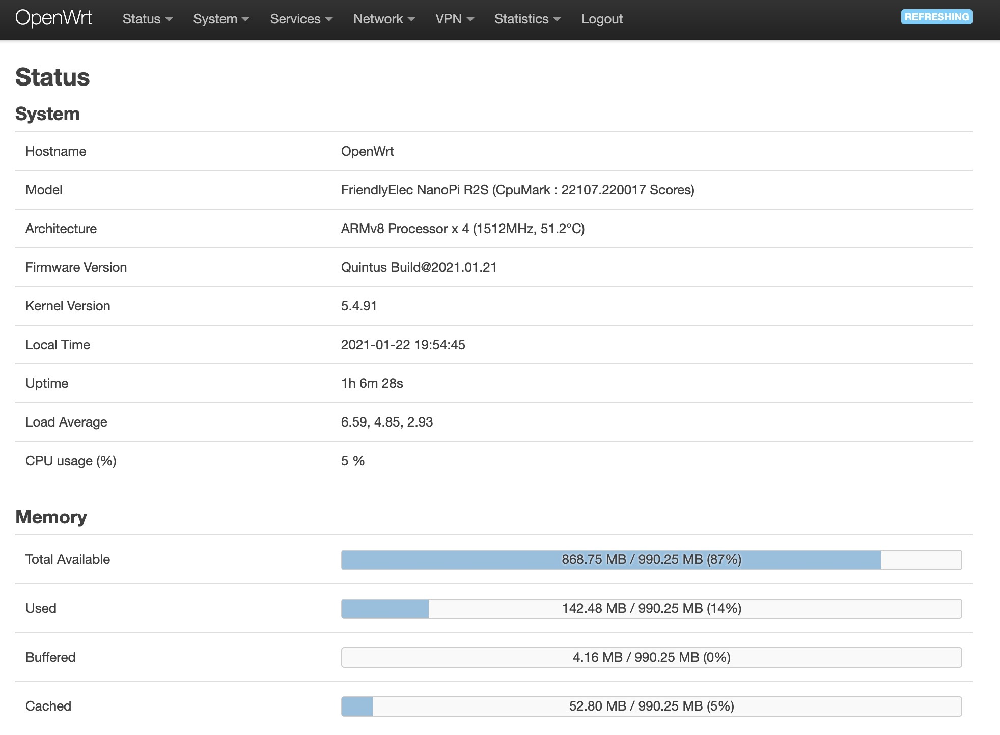
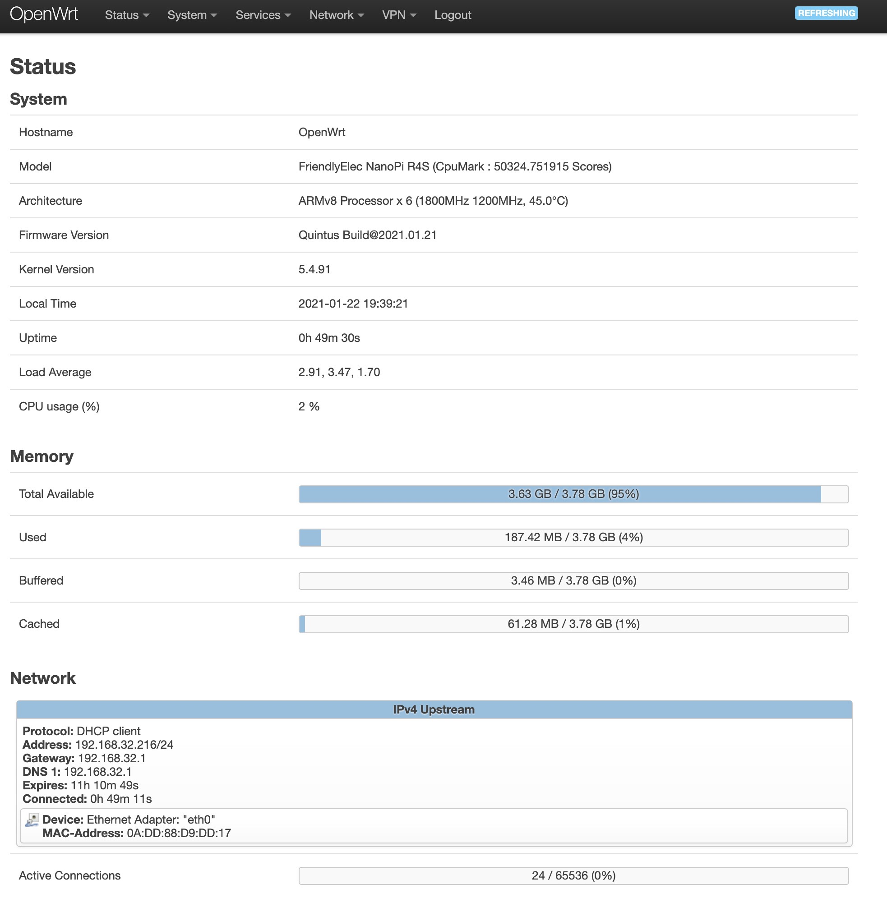

## OpenWrt R2S and R4S Firmware 
#### ⚠ WARNING: USE IT UNDER YOUR OWN RISK. Non profit use only ⚠ 

##### Download: [Releases](https://github.com/quintus-lab/Openwrt-R2S/releases) or [Actions](https://github.com/quintus-lab/Openwrt-R2S-R4S/actions) \(Login Needed\)
- - -
## Introduction
- ### Usage
0. OpenWRT Official master source code + CTCGFW & Lean's packages code  
1. Default Management IP addr is [192.168.1.1](192.168.1.1), username: `root`  , no password 
 Please setup the login password **as soon as possible** once you logined.
2. Once you flashed the firmware into SD card, you may simply use "Upgrade" function 
 in LuCI (no need to decompress the **.gz** archive) if you want to update it.
3. Support USB LTE Hilink Dongle and USB Tethering. 
4. Can keeping configurations in upgrade is **suggested**, it's totally unnecessary to drop them.

- ### Applications
  AccessControl, ADbyby, CFDisk, DDNS, DiskMan, FRP, Gost, SpeedTest-CLI, SSRPlus, Socat, Stress-ng, Tmate, UPNP, Wake-On-LAN, WireGuard, ZeroTier etc.
- - -

### Thanks to Bigwigs:

- [CN_SZTL](https://github.com/1715173329)
- [QiuSimons](https://github.com/QiuSimons)
- [CTCGFW](https://github.com/project-openwrt/openwrt)
- [AmadeusGhost](https://github.com/AmadeusGhost)
- [Lean](https://github.com/coolsnowwolf/lede)

### License
[MIT](https://github.com/quintus-lab/Openwrt-R2S-R4S/blob/master/LICENSE)

🇹🇼🇨🇦🇺🇸🇭🇰

#### Screenshot

