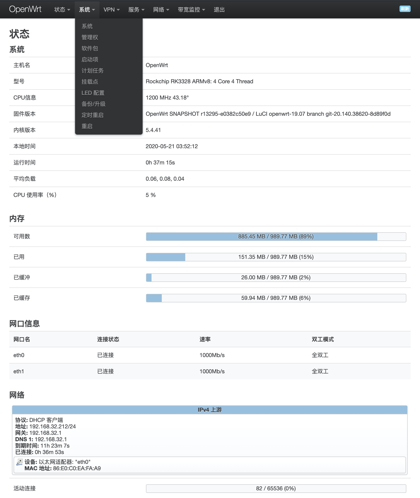

#### OpenWrt原生源码编译，使用前请仔细阅读如下说明：
***如果厌烦TF上squashfs更新系统可能无法真正清除upper layer，请直接使用ext4的版本**
1. slim版是OpenWrt当日最新源码编译，内核5.4。18.06是取CTCGFW 18.06-kernel5.4分支编译。
2. 内含ssrp、frpc/frps、gost、ddns、ttyd、zerotier、京东签到、OpenConnect VPN、gost等常用功能，部分组件可能会随时增减，cli下有stress\dig\ss\cfdisk\iftop\ifstat\iperf3\wget\nmap等工具。
3. 管理地址: 192.168.1.1 默认空密码
4. 驱动原因，暂只支持rtl8192cu芯片(仅2.4G)及mt76x2u芯片USB无线网卡，rtl8821cu/8811cu的驱动未测试通过，MT7601的驱动不支持AP模式。
5. 已测试支持Hilink模式的4G USB上网卡，NCM模式测试中。
6. 支持第3代金属壳OLED显示R2S系统信息。
7. 仅打包原版bootstrap主题，请勿轻易安装其它主题（19.07多数不兼容）。
8. 建议关闭ipv6的dns解析，以免影响网络体验，Network-DHCP and DNS-Advanced Settings-Filter IPv6 Records。
9. 已默认开启BBR及SFE，NAT Fullcone需自行开启。
10. 注意R2S网口默认MAC address相同，LAN内同时存在多个R2S请自行修改MAC为唯一。
11. Openwrt原生更新升级功能，支持各种备份、恢复及系统重置。
12. 从友善版固件刷写本固件，建议使用dd写卡：
```
dd if=/tmp/upload/openwrt.img of=/dev/mmcblk0 conv=fsync
```
13. 为避免写卡没有覆盖完全，建议首次启动后先运行firstboot清除再重启一次，或者直接使用ext4版。
14. 上游代码及编译yml更新频繁。自用测试固件，风险自负，不提供任何DaaS.
15. 下载见[OpenWrt-R2S固件](https://github.com/quintus-lab/Openwrt-R2S/releases/tag/OpenWrt)

### 感谢

- [QiuSimons](https://github.com/project-openwrt/R2S-OpenWrt)
- [CTCGFW](https://github.com/project-openwrt/openwrt)
- [Lean](https://github.com/coolsnowwolf/lede)
- [Klever1988](https://github.com/klever1988/nanopi-openwrt)
- [fanck0605](https://github.com/fanck0605/nanopi-r2s)
- [P3TERX](https://github.com/P3TERX/Actions-OpenWrt)
- [Read the details in my blog (in Chinese) | 中文教程](https://p3terx.com/archives/build-openwrt-with-github-actions.html)

#### License
[MIT]


#### Openwrt原生系統截圖：



#### Friendlywrt只是用作给一块开发板点亮，各种功能需要杂交移植，随着原生Openwrt对R2S的成熟支持，个人认为Friendlywrt的历史使命已完结。仅保留下Friendlywrt过往编译版本，不再作任何编译更新<br> 
